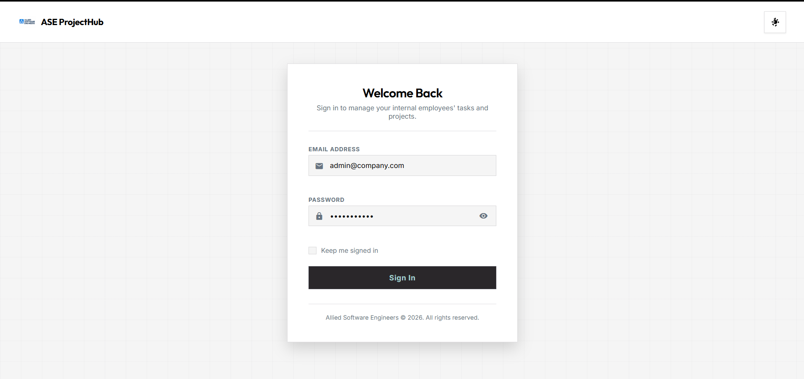
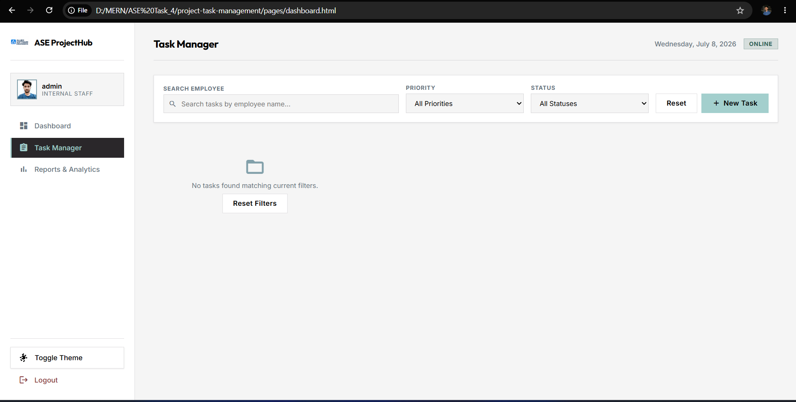
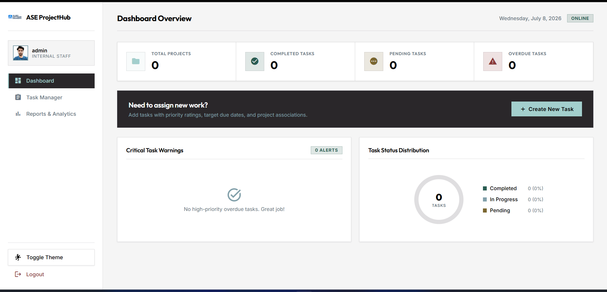
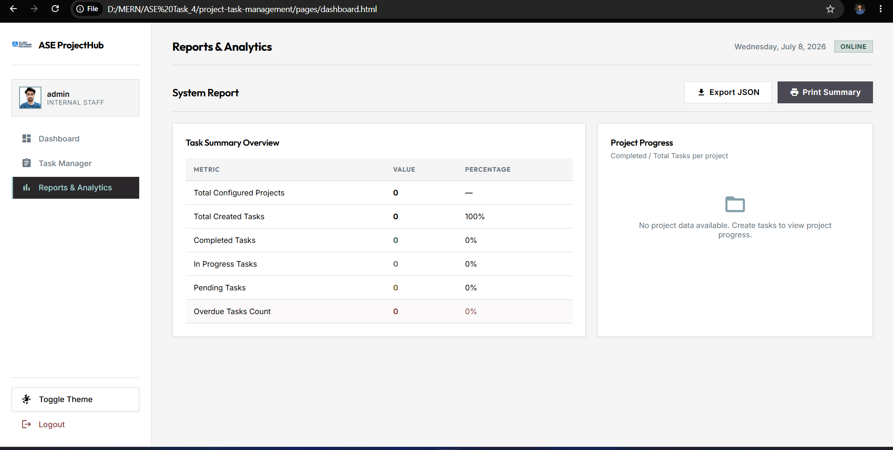
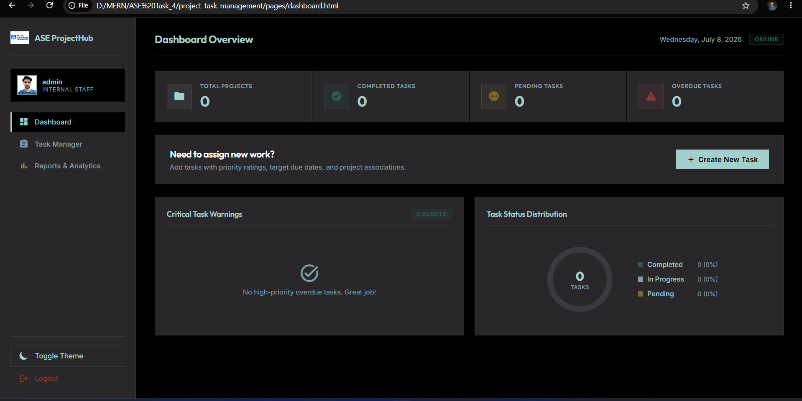

# Project & Task Management System (v1.0.0)

An advanced web application prototype built for Allied Software Engineers internal employees to manage tasks and project resources. This application showcases professional front-end engineering, robust validation engines, persistent states, and a structured DevOps branch release pipeline.

## Live Demo URL
The application is deployed on GitHub Pages at:
**[https://hrq278.github.io/ASE-Task-4/]**


---
##  Dashboard Screenshots

### Login



### Dashboard


### Tasks Grid



### Reports



### Dark Mode




##  Folder Structure
The repository is structured following industry-standard DevOps layout:
```text
project-task-management/
├── assets/         # Static images, assets, and icons
├── css/            # Stylesheets
│   ├── style.css       # Design system variables, light/dark core styling
│   ├── login.css       # Login module styling and keyframes
│   └── dashboard.css   # Dashboard and print report layouts
├── docs/           # Architecture notes and release details
├── js/             # Application controllers & business engines
│   ├── auth.js         # Authentication validation, themes & session handlers
│   ├── dashboard.js    # Statistics counts, SVG donut chart, and views manager
│   └── task.js         # CRUD database, Local Storage, filters, and validations
├── pages/          # Content views
│   ├── login.html      # Login authentication portal
│   └── dashboard.html  # Main Dashboard, Tasks Grid and Reports panels
├── screenshots/    # Visual validation logs (UI captures)
├── tests/          # Testing logs and scenarios
│   └── test-cases.md   # Manual validation scenarios
├── README.md       # Project configuration guide
├── CHANGELOG.md    # Changelog history
└── .gitignore      # Ignored temporary build files
```

---

##  Tech Stack & Features
1. **Core Architecture**: Pure HTML5 (Semantic Structure) & JavaScript ES6.
2. **Styling System**: CSS3 Custom Properties (Variables) with responsive Flexbox/Grid systems.
3. **Persistency**: Syncs with HTML5 Web Local Storage API.
4. **Theme Customization**: Beautiful Light & Dark mode support that is persistent across views.
5. **Form Validation Engine**: Strict email validation checks, and date boundary checks (Due date cannot be before Start date).
6. **Task Highlights**: Critical overdue warnings (High-priority overdue tasks highlighted in red/orange warning feeds).
7. **Reports & Exports**: Dynamic project completion percentage bars, custom SVG donut charts, print layouts (`@media print`), and Backup Export to JSON files.

---

##  Local Setup & Execution
No heavy runtime or database setups are required. You can run the application directly inside any web browser.

### Option A: Local Browser Launch
1. Clone or extract this repository to your local drive.
2. Navigate to the `pages/` directory.
3. Double-click `login.html` to open it in your browser.

### Option B: Local Development Server (Recommended)
If using VS Code:
1. Install the "Live Server" extension.
2. Right-click `pages/login.html` and select **Open with Live Server**.

### Pre-filled Demo Credentials
To expedite testing, the login fields are pre-filled:
- **Email**: `admin@company.com`
- **Password**: `password123`

---

##  Git Release Pipeline
We maintain a strict branching standard:
- `main`: Production-ready code (V1.0 releases).
- `development`: Primary integration branch.
- `feature-login`: Authentication form & field checks (Merged).
- `feature-dashboard`: Stat summary grids, SVG donut chart (Merged).
- `feature-task-module`: Modal forms, filters, Local Storage (Merged).
- `release-v1.0`: Pre-release documentation, metadata adjustments, and validation tests (Active).
- `hotfix-validation`: Critical fixes applied directly to release (Merges into release/dev).

---

